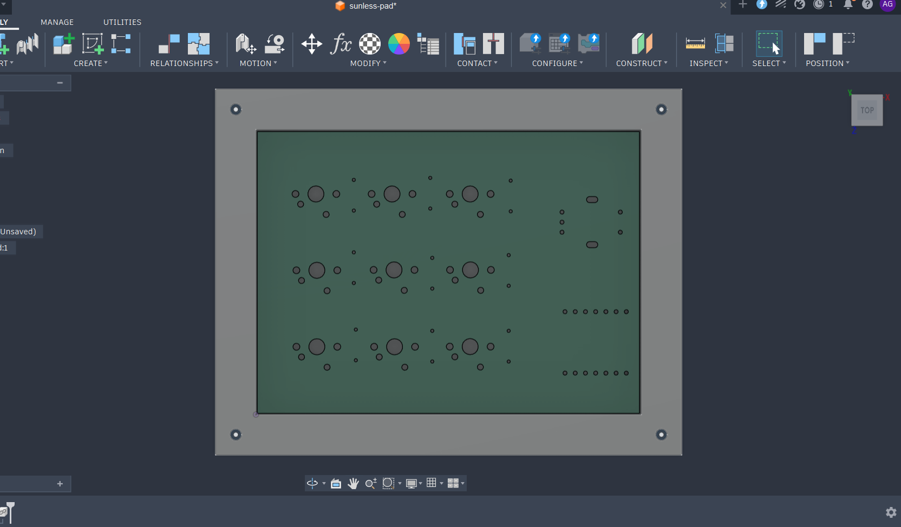
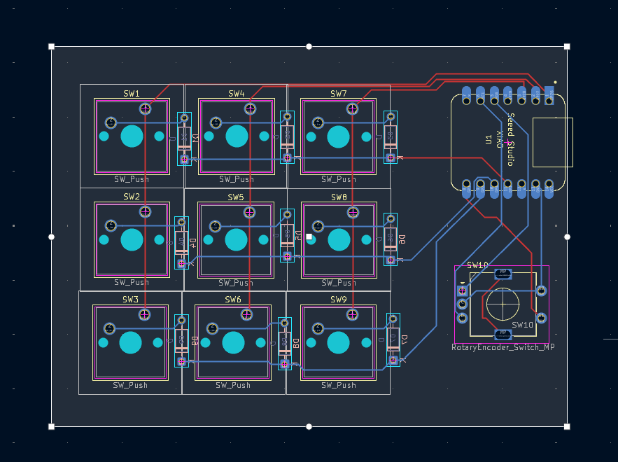
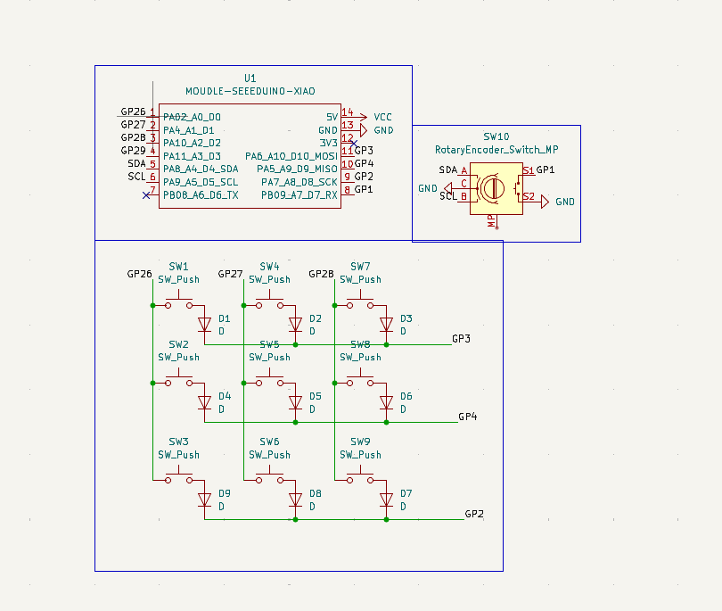

# this is dadadad pad
A 3x3 macropad that lets you get extra shortcuts, and also helps you adjust the volume 

## Note from me
It is a custom macropad powered by a Seeed XIAO RP2040 microcontroller and QMK Firmware, fully customizable and most importnatly so cool!!!!
this is one of the few htings that i hoped one day i would be able to make. and i am so proud to be able to do this!!!!

## Features include:

- 3x3 Matrix 
- One Rotary Encoder
- Custom PCB 

